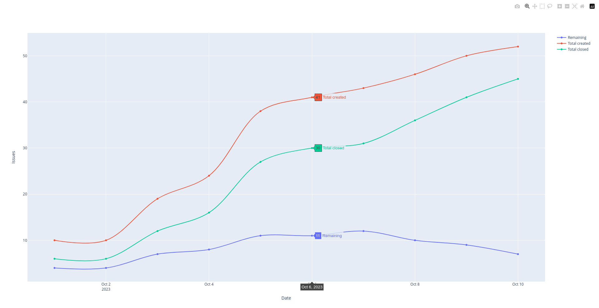

# Burndown chart for GitLab

Generate charts of issues in a GitLab repo.



## Setup

1. Clone the repository.

2. Create `config.json`.

    - example:

        ```json
        {
            "host": "https://gitlab.example.com",
            "project_id": "4"
        }
        ```

3. Install Nix - [link](https://github.com/deemp/flakes/blob/main/README/InstallNix.md#install-nix).

4. Run script.

    ```console
    nix run
    ```

5. Open the generated `index.html` in a browser.
