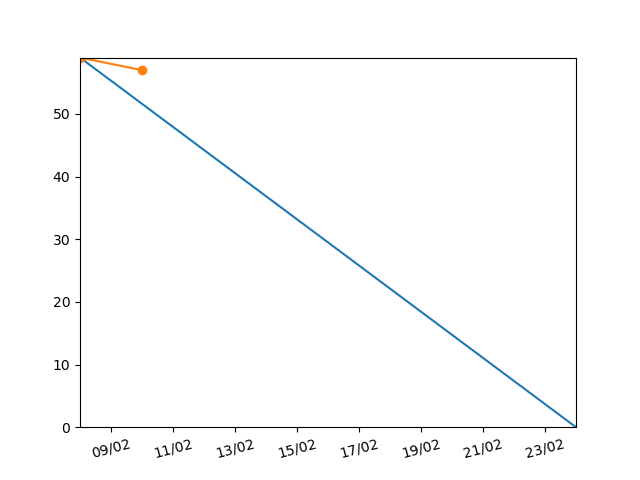

# burndown-chart-gitlab
python script that generates a burndown-chart of a gitlab project


amount of tasks / time

# How to setup
clone the repository 

install dependencies
```sh
pip install -r requirments.txt
```

in config.json file fill in:
```json
{
    "link": "gitlab_link",
    "access_token": "gitlab_access_token",
    "project_path": "path_to_repository",
}
```

run 
```sh
python main.py
```
